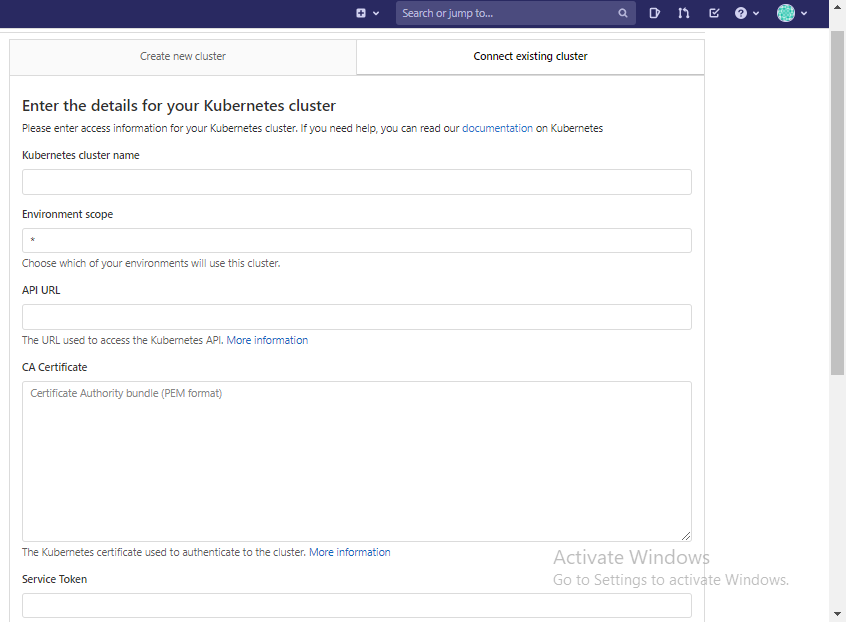
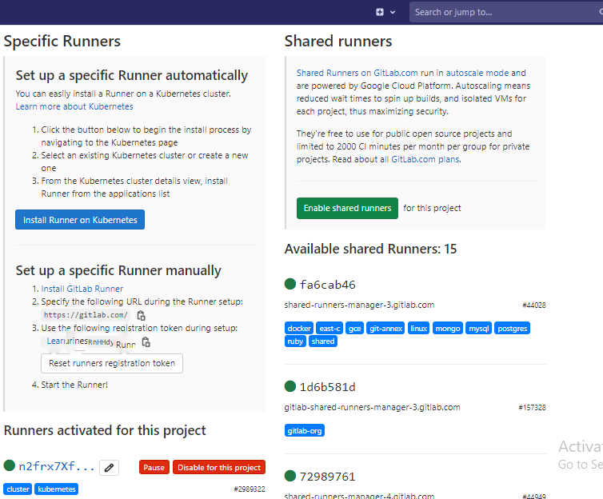
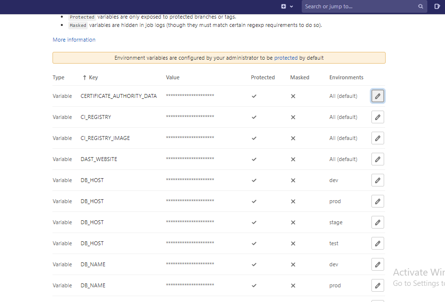
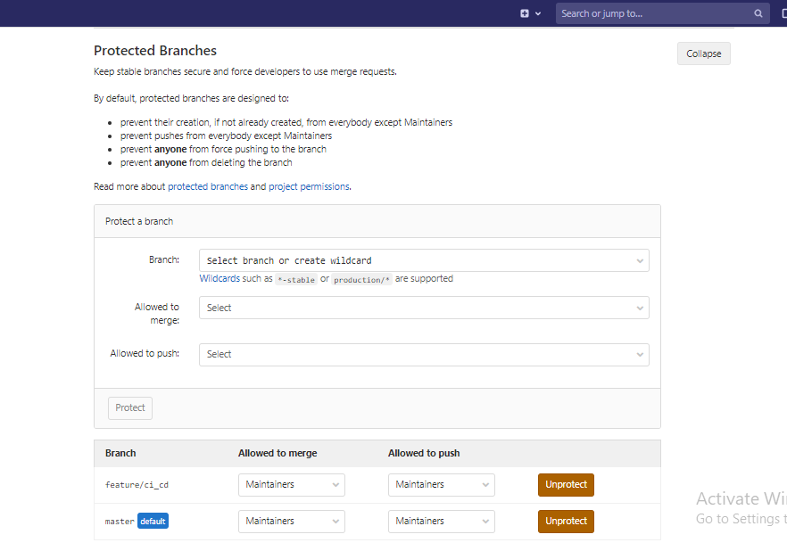

<h1> Setting up CICD  Pipeline for React Stub</h1>

<h2>PreRequisites:</h2>

1. AWS EKS must be up and running.

2. Must have atleast Maintainer Role Access on GitLab.

3. The Repository must be available in working condition.

4. DB server for all ENVs must be up and running.

5. The pipeline will only work using master branch.

<h2>Process:</h2>

1.  For Connecting Kubernetes to GitLab, Click on Kubernetes in Operation option and follow these steps:

        i.    Click on "Connect Cluster", there will be two options for connecting EKS, we will use "Connect Existing Cluster". 
        ii.   Go to "Connect Existing Cluster" section, then provide following details: (for more information please use this link: https://docs.gitlab.com/ee/user/project/clusters/add_remove_clusters.html#add-existing-cluster )
                    a) Kubernetes cluster name
                    b) Environment scope (use * if this cluster will be common for all deployments)
                    c) API URL
                    d) CA Certificate
                    e) Service Token
                    f) Project namespace prefix (please put "env" as it has dependency in .gitlab-ci.yml file)

        iii.  Within one minute, It will connect. Then Click on this cluster and go on applications section.
        iv.   Install following application:
                    a) GitLab Runner (All the process should be on EKS)
                    b) Prometheus  (For monitoring load and tracking server logs)
                    c) More applications can be installed as per the use.

2. Then go to CICD section in Settings, In Runners section, disable shared runners if it is enabled and Ensure that it is using the runner for which we have installed "runner" appliation in EKS.
                    

3. In Auto DevOps section Ensure that it is disabled.

4. In Variables section, please add following variables:

       i.    CERTIFICATE_AUTHORITY_DATA:  <copy from EKS> (Environment can be default)
       ii.   CI_REGISTRY: registry.gitlab.com (Environment can be default)
       iii.  CI_REGISTRY_IMAGE: registry.gitlab.com/alliedmedia/<project-name>
       iv.   SERVER: <server api url, copy from EKS> (Environment can be default)   
       v.    DAST_WEBSITE: < allied media domain name >  (Environment can be default)    
       vi.   USER_TOKEN: <Service Token, copy from EKS >  (Environment can be default)   
       vii.  DOCKER_USER: <use a specific user for registry>  (Environment can be default)   
       viii. DOCKER_PASS: <use a specific user for registry>  (Environment can be default)    
       ix.   secret_for_accessing_gitlab_registry: (This variable must be different for each environment)
       x.    SERVER_PORT: (This variable must be different for each environment )
       xi.   DB_HOST: (This variable must be different for each environment )
       xii.  DB_USER: (This variable must be different for each environment )
       xiii. DB_PASSWORD: (This variable must be different for each environment )
       ivx.  DB_NAME: (This variable must be different for each environment )
       vx.   RELEASE_FILE: (Environment can be default)
                    

5. If there is a requirement of using any specific branch for cicd then go in repositoy option in settings, Exapnd "Protected Branches", here you have to add the branch.
                    

6. Now pipeline can be triggered by pushing code using master branch or from console by triggering pipeline using master branch.
     
     
     
